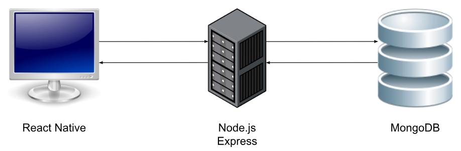

# Montgomery SafetyMap App

## 1. URLs de acceso
La aplicación está desplegada en un entorno cloud, permitiendo el acceso directo a sus distintos componentes sin necesidad de instalación local.

### Backend
- https://backend-9u99.onrender.com/
- Documentación Swagger: https://backend-9u99.onrender.com/api-docs/

### Frontend
- https://frontend-montgomery-safetymap.onrender.com/

## 2. Credenciales de acceso
### Policía
- Correo: policia@montgomerysafetymap.com
- Contraseña: 123456

### Administrador
- Correo: admin@montgomerysafetymap.com
- Contraseña: 123456

## 3. Arquitectura

La aplicación sigue una arquitectura de **3 niveles (3-tier architecture)**, lo que garantiza una separación clara de responsabilidades y facilita el mantenimiento y escalabilidad del sistema:

1.  **Nivel de Presentación (Frontend)**: Interfaz de usuario desarrollada con React Native y Expo, encargada de la visualización de mapas, estadísticas e interacción con el usuario.
2.  **Nivel de Lógica de Negocio (Backend)**: API REST construida con Node.js y Express que procesa las peticiones, gestiona la seguridad (JWT) y ejecuta la lógica del servidor.
3.  **Nivel de Datos (Base de Datos)**: Almacenamiento persistente basado en MongoDB Atlas, donde se gestionan las colecciones de delitos, usuarios, alertas y resultados del modelo de IA.



## 4. Fuentes de datos

Los datos utilizados en la aplicación provienen del portal oficial de datos abiertos del Departamento de Policía del Condado de Montgomery, disponibles [aquí](https://data.montgomerycountymd.gov/Public-Safety/Crime/icn6-v9z3/about_data).

La información se obtiene diariamente mediante la API pública en formato CSV y se integra en la aplicación para su posterior almacenamiento y consulta. Estos datos incluyen registros de delitos reportados y clasificados según el sistema NIBRS (National Incident-Based Reporting System), garantizando un estándar oficial y homogéneo.

Los datos se actualizan diariamente para reflejar los nuevos incidentes registrados, permitiendo que la aplicación trabaje siempre con información reciente y fiable.


## 5. Backend

### 5.1. Tecnologías
El backend de la aplicación ha sido desarrollado utilizando **JavaScript** sobre el entorno de ejecución **Node.js**, permitiendo construir una arquitectura eficiente y escalable para la gestión de la API y la comunicación con la base de datos.

### 5.2. Módulos utilizados
Para la implementación del backend se han utilizado los siguientes módulos y librerías:
- **Express**: Framework web principal utilizado para construir la API REST, gestionar las rutas y manejar las peticiones y respuestas HTTP.
- **Mongoose**: Librería ODM que facilita la interacción con la base de datos MongoDB, permitiendo definir esquemas y modelos de datos de forma estructurada.
- **JSONWebToken (JWT)**: Utilizado para implementar la autenticación y autorización segura de usuarios mediante la generación y verificación de tokens de acceso.
- **Bcryptjs**: Módulo encargado de la seguridad de las contraseñas, permitiendo su encriptación (*hashing*) antes de ser almacenadas en la base de datos.
- **CORS**: Middleware necesario para permitir que el front-end se comunique con el back-end desde diferentes dominios o puertos.
- **Dotenv**: Herramienta para la gestión de variables de entorno, permitiendo configurar de forma segura datos sensibles como las claves de la base de datos.
- **Winston**: Sistema de *logging* avanzado para registrar eventos, errores y actividad del servidor, facilitando el mantenimiento y la depuración.
- **Swagger (`swagger-jsdoc` y `swagger-ui-express`)**: Módulos utilizados para generar la documentación interactiva de la API, permitiendo visualizar y probar los endpoints.
- **Jest y Supertest**: Herramientas para la automatización de pruebas unitarias y de integración, garantizando el correcto funcionamiento del servidor y de la API.

### 5.3. Enlace a la documentación de la API (Swagger)
La API del backend dispone de documentación interactiva generada con Swagger, que permite consultar y probar los distintos endpoints disponibles de forma sencilla.
- https://backend-9u99.onrender.com/api-docs/

### 5.4. Enlace a la solución
El backend de la aplicación está desplegado en la plataforma Render, proporcionando acceso a la API REST utilizada por el frontend y los distintos servicios del sistema.
- https://backend-9u99.onrender.com/

## 6. Frontend
### 6.1. Tecnologías
El frontend de la aplicación ha sido desarrollado utilizando **React** y **React Native**, permitiendo construir una interfaz moderna, multiplataforma y adaptable tanto a dispositivos móviles como a entorno web. Además, se ha utilizado el ecosistema **Expo**, que facilita el acceso a funcionalidades nativas, simplifica el desarrollo y optimiza el despliegue de la aplicación en diferentes plataformas.

### 6.2. Módulos utilizados
Para la implementación del frontend se han utilizado los siguientes módulos y librerías:

- **React 19 y React Native 0.83**: Base principal para el desarrollo de componentes e interfaces de usuario declarativas y nativas.
- **Expo (v55)**: Ecosistema utilizado para simplificar el desarrollo, compilación y despliegue de aplicaciones móviles y web.
- **React Navigation**: Librería utilizada para gestionar la navegación entre pantallas mediante stacks, tabs y rutas dinámicas.
- **React Native Paper**: Biblioteca de componentes visuales basada en Material Design para mantener una interfaz consistente y profesional.
- **Expo Vector Icons**: Sistema de iconografía utilizado para mejorar la experiencia visual e interacción de usuario.
- **Expo Google Fonts**: Utilizado para integrar tipografías personalizadas y mejorar la legibilidad de la interfaz.
- **Expo Linear Gradient y Expo Blur**: Librerías empleadas para aplicar efectos visuales modernos como degradados y glassmorphism.
- **Nivo y D3.js**: Herramientas utilizadas para generar gráficos interactivos y visualizaciones de datos relacionadas con delitos y alertas.
- **React Native Maps**: Librería utilizada para mostrar mapas nativos en dispositivos móviles.
- **Leaflet y React Leaflet**: Utilizados para la representación de mapas interactivos en la versión web de la aplicación.
- **Async Storage**: Sistema de almacenamiento local empleado para persistir información como sesiones de usuario y preferencias.
- **React Native Dotenv**: Utilizado para gestionar variables de entorno y separar configuraciones de desarrollo y producción.
- **ESLint**: Herramienta de análisis estático utilizada para mantener la calidad y consistencia del código.
- **Jest y React Testing Library**: Frameworks utilizados para realizar pruebas unitarias y de interfaz sobre los componentes del frontend.
- **Playwright**: Herramienta utilizada para la ejecución de pruebas de extremo a extremo (E2E), permitiendo validar flujos completos de usuario en el navegador.

### 6.3. Enlace a la solución
El frontend de la aplicación está desplegado en un entorno cloud, permitiendo el acceso directo a la interfaz de usuario desde cualquier navegador o dispositivo compatible.
- https://frontend-montgomery-safetymap.onrender.com/

### 6.4. Enlace al prototipado
El diseño previo de la interfaz de la aplicación se ha realizado mediante herramientas de prototipado, permitiendo definir la estructura, navegación y experiencia de usuario antes del desarrollo.
- Prototipo en Figma: https://www.figma.com/design/jturFrWoDGK3gMEqeNcalz/prototipo-web?node-id=0-1&p=f&t=6VYpvgB15qtBI7QO-0
- Vista en Google Drive: https://drive.google.com/file/d/1tXh0oZXj6NeFcIc40Y97BnjIgEnPsKTT/view?usp=sharing


## 7. Modelo de IA
La aplicación incorpora un sistema de predicción basado en Inteligencia Artificial para calcular el **Índice de Criminalidad (IC)** de cada beat y distrito policial del Condado de Montgomery.

El modelo utiliza datos históricos de delitos obtenidos diariamente desde el [portal oficial de datos abiertos de la policía del Condado de Montgomery](https://data.montgomerycountymd.gov/Public-Safety/Crime/icn6-v9z3/about_data). Antes del entrenamiento, los datos son limpiados y transformados mediante procesos de eliminación de duplicados, filtrado temporal, corrección de ciudades y eliminación de delitos no relevantes.

Para las predicciones se utiliza el algoritmo **Random Forest**, implementado en KNIME mediante los nodos **Random Forest Learner** y **Random Forest Predictor**. Se entrenan modelos independientes para realizar predicciones diarias, mensuales y anuales.

Todo el proceso de entrenamiento, generación de predicciones y actualización de la base de datos se ejecuta automáticamente cada día mediante KNIME Community Hub y MongoDB Atlas.

Más información del flujo de KNIME [aquí](https://docs.google.com/document/d/1K1Zw8jnaz5YiJaAUpngNs-2xOC3YSdumcmYzIkKd_3E/edit?usp=sharing).

## 8. Validación y pruebas

### 8.1. Pruebas manuales
Se han realizado pruebas manuales exploratorias tanto en el backend como en el frontend con el objetivo de verificar el correcto funcionamiento general de la aplicación, la coherencia de los datos y la correcta interacción entre las distintas partes del sistema (API, base de datos e interfaz de usuario). Estas pruebas permitieron detectar y corregir posibles errores en fases tempranas del desarrollo.

### 8.2. Pruebas automáticas

#### Backend
El backend de la aplicación ha sido validado mediante un conjunto de pruebas automatizadas desarrolladas con **Jest** y **Supertest**. Se han implementado pruebas unitarias e de integración que verifican el comportamiento de las principales rutas del sistema, la autenticación de usuarios, la gestión de roles, el registro de solicitudes y el acceso a los datos de criminalidad.

Los resultados obtenidos muestran una ejecución completa y satisfactoria de las pruebas, con:

- **123 tests ejecutados y superados**
- **11 test suites aprobadas**
- **Cobertura de sentencias:** 87.83%
- **Cobertura de ramas:** 85.27%
- **Cobertura de funciones:** 92.59%
- **Cobertura de líneas:** 87.76%

Las pruebas automáticas del backend se ejecutan mediante:
```bash
npm run test:coverage
```

#### Frontend (E2E)
Para el frontend se han implementado pruebas de extremo a extremo (**E2E**) utilizando **Playwright**. Estas pruebas simulan la interacción real de un usuario con la aplicación en un navegador web, garantizando que los flujos críticos de negocio funcionen correctamente en un entorno real.

Se han desarrollado los siguientes escenarios de prueba:
- **Flujo de Registro (`register.spec.js`)**: Verifica el proceso de creación de una cuenta para un agente de policía, la navegación desde la landing page y el inicio de sesión automático tras el éxito.
- **Estadísticas de Visitante (`stats.spec.js`)**: Valida que los ciudadanos pueden consultar las estadísticas de criminalidad y que los filtros temporales (Último mes vs. Último año) actualizan los datos de forma dinámica.

Las pruebas E2E del frontend se ejecutan mediante:
```bash
npm run test:e2e
```

## 9. Mejoras implementadas

### 9.1. Aumento de la cobertura de código en backend

Se ha alcanzado una **cobertura de código superior al 75%** en el backend, superando ampliamente el mínimo exigido. Esta mejora se ha conseguido mediante la implementación de pruebas automatizadas con **Jest** y **Supertest**, cubriendo los principales módulos del sistema: controladores, rutas, middlewares y modelos.

Los resultados obtenidos muestran una ejecución completa y satisfactoria de las pruebas, con:

- **123 tests ejecutados y superados**
- **11 test suites aprobadas**
- **Cobertura de sentencias:** 87.83%
- **Cobertura de ramas:** 85.27%
- **Cobertura de funciones:** 92.59%
- **Cobertura de líneas:** 87.76%

Comando para ejecución de las pruebas y medición de la cobertura:
```
npm run test:coverage
```

### 9.2. Uso de analizadores estáticos de código

Se ha incorporado el uso de **analizadores estáticos de código** en el proyecto, tanto en backend como en frontend, con el objetivo de detectar posibles errores, malas prácticas (*code smells*), vulnerabilidades y dependencias obsoletas.

Se ha utilizado **ESLint**, permitiendo mantener un estilo de código consistente y detectar errores comunes durante el desarrollo.

Comando para la ejecución del analizador estático de código:
```
npm run lint
```
El resultado de su ejecución muestra que el proyecto no presenta errores ni advertencias, con 0 warnings y 0 errors.


### 9.3. Integración y Despliegue Continuo (CI/CD)

La aplicación utiliza un flujo avanzado de **Integración y Despliegue Continuo (CI/CD)** para garantizar la estabilidad del sistema y automatizar el ciclo de vida del software.

#### GitHub Actions (CI)
Tanto el repositorio de backend como el de frontend cuentan con flujos de trabajo automatizados mediante **GitHub Actions** (`ci.yml`). Cada vez que se realiza un *push* o se abre un *pull request* a la rama principal (`main`), se disparan las siguientes tareas:
- **Backend CI**: Instalación de dependencias y ejecución de la suite completa de pruebas unitarias e integración con Jest.
- **Frontend CI**: Instalación de dependencias, ejecución de pruebas de componentes y compilación (*build*) de la versión web para asegurar que no hay errores de transpilación.

#### Despliegue en Render (CD)
El despliegue de la aplicación está automatizado mediante la plataforma **Render**. Para asegurar la máxima fiabilidad, se ha configurado de la siguiente manera:
- **Despliegue condicional**: Render está conectado a los repositorios de GitHub, pero el despliegue automático (*Auto-deploy*) está sincronizado con el estado del CI. 
- **Validación previa**: Solo si todas las pruebas automatizadas de GitHub Actions finalizan con éxito (estado *Green*), Render procede a descargar el nuevo código y actualizar los servicios en la nube. Esto evita que errores de código o regresiones lleguen al entorno de producción.


## 10. Valoración global

El desarrollo de **Montgomery SafetyMap** ha concluido con éxito, logrando integrar de manera cohesiva tecnologías de vanguardia en el ámbito del desarrollo web, móvil y la ciencia de datos. La aplicación no solo cumple con los requisitos funcionales establecidos, sino que ofrece una solución tecnológica avanzada para un problema social crítico: la seguridad ciudadana.

Los puntos clave que definen el éxito de este proyecto son:

1.  **Integración Tecnológica**: Se ha conseguido una comunicación fluida entre un backend robusto en Node.js, una base de datos NoSQL escalable (MongoDB Atlas) y un frontend multiplataforma desarrollado con React Native y Expo. La arquitectura permite una experiencia de usuario ágil y reactiva tanto en dispositivos móviles como en navegadores.
2.  **Valor Añadido mediante IA**: La implementación de modelos predictivos mediante Random Forest ha permitido transformar datos históricos estáticos en información dinámica y accionable. El Índice de Criminalidad (IC) proporciona una capa de inteligencia que diferencia a esta plataforma de un simple mapa de incidentes.
3.  **Calidad y Mantenibilidad**: El proyecto destaca por su compromiso con las buenas prácticas de ingeniería de software. La cobertura de tests superior al 75% (alcanzando más del 85% en sentencias) en el backend, la implementación de pruebas E2E con Playwright en el frontend y el uso de análisis estático (ESLint) garantizan un código limpio, seguro y fácil de mantener a largo plazo.
4.  **Enfoque en el Usuario**: Se ha diseñado una interfaz moderna y accesible (basada en Material Design), adaptada a las necesidades específicas de tres perfiles de usuario distintos: ciudadanos, policías y administradores, asegurando que cada uno tenga las herramientas necesarias para cumplir su rol en el ecosistema de seguridad.

En conclusión, Montgomery SafetyMap representa una herramienta potente para la democratización de los datos de seguridad pública, fomentando la colaboración entre la comunidad y las fuerzas del orden mediante la transparencia y la tecnología.

## 11. Futuras mejoras

El proyecto Montgomery SafetyMap ha sentado las bases de una plataforma robusta para la seguridad ciudadana, pero existen diversas líneas de evolución para potenciar su impacto:

- **Sistema de Notificaciones Push**: Implementar un servicio de notificaciones en tiempo real para que los ciudadanos reciban alertas inmediatas cuando se reporte un incidente de alta gravedad en su beat actual o en sus zonas de interés guardadas.
- **Modo Offline y Sincronización**: Optimizar la aplicación para permitir la consulta del mapa de calor y las estadísticas básicas en situaciones de baja conectividad, sincronizando los datos localmente mediante *service workers* o bases de datos locales.
- **Ampliación del Modelo de IA**: Evolucionar el modelo de predicción actual incluyendo variables exógenas como el calendario de eventos locales, condiciones meteorológicas o datos socioeconómicos, lo que permitiría aumentar la precisión del Índice de Criminalidad (IC).
